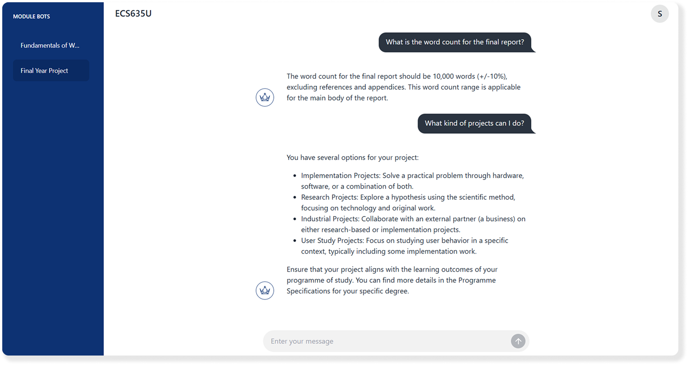

# Q-Module-Bot
> Final Year Project by Roman James John Pretty
> 

Welcome to Q-Module-Bot, an AI Chatbot for use by Queen Mary University of London Students!

This is my 2025 Final Year Project used in a study to answer the research question:<br/>
_**"Is student learning and engagement positively affected by the implementation and integration of an automated chatbot system?".**_

<br/>
<div style="text-align: center; width: 100%;">
  
</div>
<br/>

## Running the Application
### Deployed Application (Recommended)
To use Q-Module-Bot, you will need access to valid login credentials for the website. These can be located in the supporting materials uploaded to QMPlus.

Once you have these, you can log in to Q-Module-Bot at [https://qmodulebot.com](https://qmodulebot.com/).

### Local Installation
To run Q-Module-Bot locally, you will need to follow an extensive setup process to configure the database, environment variables and python environment. Whilst I outline the steps to do this below, I recommend simply using the test account on the deployed module bot.
> Due to the nature of the project, a completely new installation will not contain any accounts or modules. These will have to be generated manually.

<details>
<summary>Click to expand for local installation instructions</summary>

#### Prerequisites
- [Python 3.13](https://www.python.org/downloads/release/python-3130/)
- [PostgreSQL 16](https://www.postgresql.org/download/) (Incompatible with later versions)
- [pgvector](https://github.com/pgvector/pgvector) extension for postgres
- [Chrome and Chromedriver](https://googlechromelabs.github.io/chrome-for-testing/)
- An OpenAI API Key (You can get one [here](https://platform.openai.com/signup))

#### Setup
1. If viewing on Github, clone this repository. If you are reading this in the QMPlus supporting materials, extract the files to your local machine.
2. Navigate to the root directory of the project and run the following command to install the necessary dependencies:
   ```
   pip install -r requirements.txt
   ```
3. Next, you must create a PostgreSQL database using the pgvector extension.
   - Using pgAdmin create a new database called `q-module-bot`
   - Open the query tool and run the following command:
     ```
     CREATE EXTENSION vector;
     ```
4. Create a `.env` file in the root directory of the project and add the following environment variables:
   ```
   DATABASE_ENGINE=postgresql
   DATABASE_NAME=q-module-bot
   DATABASE_USER=<your postgres username>
   DATABASE_PASSWORD=<your postgres password>
   DATABASE_HOST=localhost
   DATABASE_PORT=5432
   DATABASE_SERVICE_NAME=postgres
   ```
5. Add other essential .env values to the file
   ```
   VITE_DEV_MODE=False
   DEV_MODE=True
   DJANGO_SECRET_KEY=<a long, random key>
   GOOGLE_CHROME_BIN=<location of your chrome binary>
   CHROMEDRIVER_PATH=<location of your chromedriver>
   OPENAI_API_KEY=<your openai api key>
   ```
6. Now, you can run migrations to create the necessary database tables:
   ```
   python manage.py migrate
   ```
7. And create a user to access the site:
   ```
   python manage.py createsuperuser
   ```
8. Finally, you can run the server using the following command:
   ```
    python manage.py runserver
    ```
9. You can now access the site at [http://localhost:8000](http://localhost:8000) and log in using the superuser account you created in step 7.
10. In order to generate a new module, you need to grant your account the module organizer role. To do this navigate to the admin panel at [http://localhost:8000/q-admin](http://localhost:8000/q-admin) and select the user you created in step 7.<br>
    Select the user and edit them, ticking the is_module_organizer checkbox.
11. You are now able to access the [dashboard](http://localhost:8000/dashboard) and create a new module. You can do this by clicking the "Create Module" button in the top right corner of the page. This will take you to a form where you can enter the module name, code, and description. Once you have filled out the form, click the "Create Module" button to create the module.
    > This step requires you to use your QMPlus credentials to generate the module. These are not stored at any point.
</details>

## Navigating the Source Code
- If preferred, Q-Module-Bot's source code is available on my [Github](https://github.com/Roman-Pretty/module-bot).
### Backend
The backend of the site is built using Django, and the most important backend code is located in the api/views directory.<br/>
This is where all of the API endpoints I have created are located.

### Frontend
The frontend of the site is built with Vue.js and its extensions Pinia and Vue Router. The frontend code is located in frontend/src.<br/>
The views folder here contains all the pages for the site.